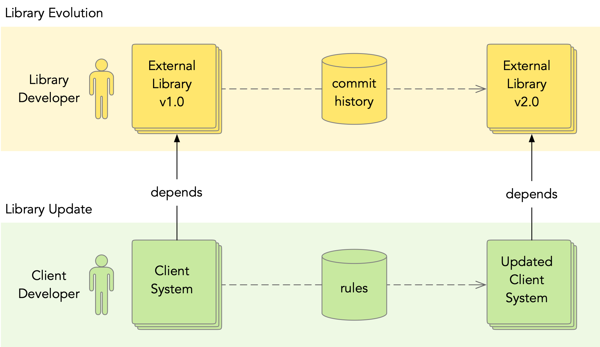

# Understanding the Problem of Library Update

Most modern software depends on a plethora of external libraries (I use the term *library* or *external library* as a general reference to any external software dependency: library or framework). Each one of those libraries is a separate project that is managed by its own team of developers. Like any other software, libraries evolve from one version to another, certain parts of their Application Programming Interfaces (API) are changed: e.g. classes, methods, or fields get renamed, deleted, or moved around, new functionality is introduced, etc. Every time the external library releases a new version, developers of client software that depends on this library are facing a choice: either *to update* their system to the new version of the library, thus dealing with the added cost of refactoring, or *not to update* and keep using the old version of the library, thus missing out on the new or improved functionality and dealing with all the challenges of being dependent on the obsolete software. In my PhD, I focus on aiding the developers who chose the first option and decided to perform the library update on their systems. In my work, I use the term *library update* to refer to the problem of updating client systems from the old version of a library to the new one (e.g. *Struts v1.2.8* -> *Struts v1.2.9*). The term *library migration* is reserved for the task of migrating client systems from one external library to a completely different one (e.g. *easymock* -> *mockito*). However, in the literature, these terms are used interchangeably.

The Figure above illustrates the general case of library update and helps understand the terminology that I use to refer to different actors and entities that are involved in this process. The **client system** is any piece of software that has external dependencies and needs to be updated to the new version of a given library. The client system is maintained by one or many **client developers**; it is their responsibility to update the client system. The **external library** is the dependency of a client system that has been updated to the new version. Version numbers *v1.0* and *v2.0* in the Figure symbolise any kind of version increment, for example from *v19.10.8* to *v21.0.1*. The changes that the external library undergoes with the release of every new version are collectively called the **library evolution**. Those changes can be fully described by the *commit history* stored by the version control system (VCS). The external library is maintained by one or many **library developers**. They have expertise related to the implementation and evolution of the library and can aid client developers in the process of library update by providing documentation or a **library update script** for automatically updating client code. In this context, the **library update** is a sequence of manual, automatic, or semi-automatic changes applied to the client system in response to the evolution of one of its dependencies. Some of those changes can be described with a set of **library update rules** --- key-value pairs of regular expressions where the key expression (*antecedent*) matches the code that should be replaced and the value expression (*consequent*) specifies the replacement. Not all changes can be expressed with such rules. Some of the more challenging ones might require human intervention. I will discuss both cases in the following sections.
